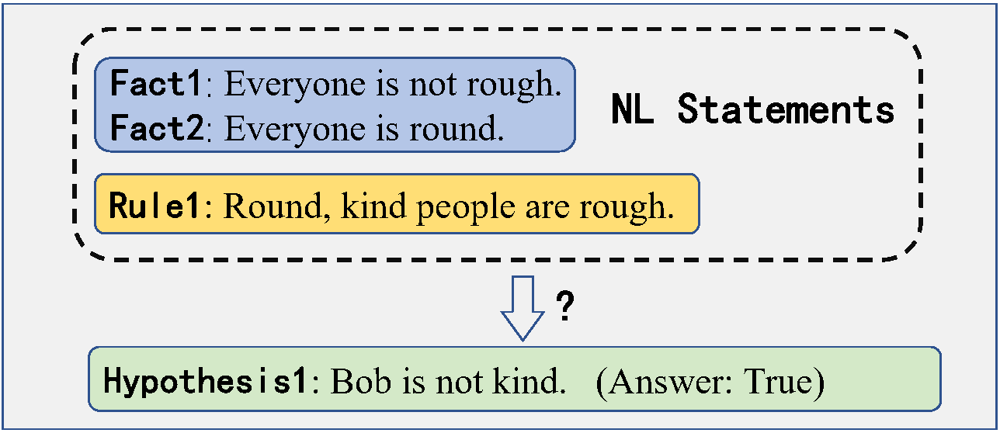
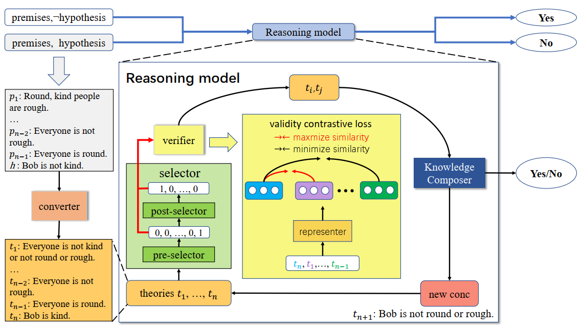

# Towards Generalizable and Faithful Logic Reasoning over Natural Language via Resolution Refutation [[paper]](https://arxiv.org/abs/2404.01677)

<p align="center">
  
</p>

Above figure shows an example of the natural language reasoning with first-order logic task that we aim to solve using our modular reasoning model GFaiR.

<p align="center">
  
</p>

Above figure depicts the overview of the GFaiR architecture.

## Dependencies

- Dependencies can be installed using `requirements.txt`.

## Quick start for GFaiR

- Download xlnet-large, T5-large model and put them under ../../model/xlnet and../../model/T5

- After setting up the data and model as described above, we can preprocess the proof data, train individual modules, followed by evaluation using the following commands. Note that we select the model with the best 'eval_acc'.

### Main Experiments and Reasoning Depth Generalization Experiments
```bash
# make data for RuleTaker-3ext-sat dataset
cd data
python create_my_example.py --model_type all --direc ruletaker_3ext_sat/
cd ..

# train convertor model
python run_convertor.py --input_dir data/ruletaker_3ext_sat --output_dir out_convertor/ruletaker --do_train --model ../../model/T5 --train_batch_size 128 --eval_batch_size 64 --gradient_accumulation_steps 4

# train reasoner model
python run_reasoner.py --input_dir data/ruletaker_3ext_sat --output_dir out_reasoner/ruletaker --do_train --model ../../model/T5 --learning_rate 1e-4 --num_train_epochs 20 --train_batch_size 128 --eval_batch_size 128 --gradient_accumulation_steps 4 --seed 42

# train post-selector and verifier model
python run_selector2.py --input_dir data/ruletaker_3ext_sat --output_dir out_selector2/ruletaker --model ../../model/xlnet --do_train --num_train_epochs 30 --train_batch_size 32 --gradient_accumulation_steps 4 --alpha 0.05

# evaluate the model on RuleTaker-3ext-sat dataset
python inference_rt.py --input_dir data/ruletaker_3ext_sat --output_dir out_inference/ruletaker_3ext_sat --convertor_init_weights_dir out_convertor/ruletaker/<best_checkpoint_name> --selector_init_weights_dir out_selector2/ruletaker_1/<best_checkpoint_name> --reasoner_init_weights_dir out_reasoner/ruletaker1/<best_checkpoint_name> --inference_batch_size 4 --beam_size 2 --candidates_num 2

# evaluate the model on Hard RuleTaker dataset
python inference_rt.py --input_dir data/hard_ruletaker --output_dir out_inference/hard_ruletaker --convertor_init_weights_dir out_convertor/ruletaker/<best_checkpoint_name> --selector_init_weights_dir out_selector2/ruletaker_1/<best_checkpoint_name> --reasoner_init_weights_dir out_reasoner/ruletaker1/<best_checkpoint_name> --inference_batch_size 4 --split test --beam_size 2 --candidates_num 2

# evaluate the model on Hard RuleTaker* dataset
python inference_rt.py --input_dir data/hard_ruletaker --output_dir out_inference/hard_ruletaker --convertor_init_weights_dir out_convertor/ruletaker/<best_checkpoint_name> --selector_init_weights_dir out_selector2/ruletaker_1/<best_checkpoint_name> --reasoner_init_weights_dir out_reasoner/ruletaker1/<best_checkpoint_name> --inference_batch_size 4 --split dev --beam_size 2 --candidates_num 2

# evaluate the model on RuleTaker-D5 dataset
python inference_rt.py --input_dir data/depth-5 --output_dir out_inference/depth-5 --convertor_init_weights_dir out_convertor/ruletaker/pytorch_model.bin2 --selector_init_weights_dir out_selector2/ruletaker_1/pytorch_model.bin54 --reasoner_init_weights_dir out_reasoner/ruletaker1/pytorch_model.bin9 --inference_batch_size 4 --beam_size 2 --candidates_num 2 --maxdep 5
```

### Experiments on RuleTaker-E
```bash
# make data for ruletaker_exist dataset
cd data
python create_my_example.py --model_type all --direc ruletaker_exist/
cd ..

# train convertor model
python run_convertor.py --model ../../model/T5 --input_dir data/ruletaker_exist --output_dir out_convertor/ruletaker_exist --do_train --train_batch_size 128 --eval_batch_size 64 --gradient_accumulation_steps 4

# train reasoner model
python run_reasoner.py --input_dir data/ruletaker_exist --output_dir out_reasoner/ruletaker_exist --model ../../model/T5 --do_train --learning_rate 5e-4 --num_train_epochs 10 --train_batch_size 128 --eval_batch_size 128 --gradient_accumulation_steps 4 --seed 42

# train post-selector and verifier model
python run_selector2.py --input_dir data/ruletaker_exist --output_dir out_selector2/ruletaker_exist --model ../../model/xlnet --do_train --num_train_epochs 30 --train_batch_size 32 --gradient_accumulation_steps 4 --alpha 0.07

# evaluate the model on ruletaker_exist dataset
python inference_rt.py --input_dir data/ruletaker_exist --output_dir out_inference/ruletaker_exist --convertor_init_weights_dir out_convertor/ruletaker_exist/<best_checkpoint_name> --selector_init_weights_dir out_selector2/ruletaker_exist/<best_checkpoint_name> --reasoner_init_weights_dir out_reasoner/ruletaker_exist/<best_checkpoint_name> --inference_batch_size 2 --beam_size 5 --candidates_num 5
```

### In-domain Experiments on Complex Reasoning Scenarios
```bash
# make data for Hard ruletaker** dataset
cd data
python create_my_example.py --model_type all --direc myhard_ruletaker/
cd ..

# train convertor model
python run_convertor.py --model ../../model/T5 --input_dir data/myhard_ruletaker --output_dir out_convertor/myhard_ruletaker --do_train --train_batch_size 128 --eval_batch_size 64 --gradient_accumulation_steps 4

# train reasoner model
python run_reasoner.py --input_dir data/myhard_ruletaker --output_dir out_reasoner/myhard_ruletaker --model ../../model/T5 --do_train --learning_rate 5e-4 --num_train_epochs 10 --train_batch_size 128 --eval_batch_size 128 --gradient_accumulation_steps 4 --seed 42

# train post-selector and verifier model
python run_selector2.py --input_dir data/myhard_ruletaker --output_dir out_selector2/myhard_ruletaker --model ../../model/xlnet --do_train --num_train_epochs 30 --train_batch_size 32 --gradient_accumulation_steps 8 --alpha 0.05

# evaluate the model on Hard ruletaker** dataset
python inference_rt.py --input_dir data/myhard_ruletaker --output_dir out_inference/myhard_ruletaker --convertor_init_weights_dir out_convertor/myhard_ruletaker/<best_checkpoint_name> --selector_init_weights_dir out_selector2/myhard_ruletaker/<best_checkpoint_name> --reasoner_init_weights_dir out_reasoner/myhard_ruletaker/<best_checkpoint_name> --inference_batch_size 2 --beam_size 2 --candidates_num 2
```

### Experiments on Natural Language Satisfiability Task
```bash
# make data for RCL 16_20_21 dataset
cd data
python create_my_example.py --model_type all --direc 3sat/relative_clause/rclause_16_20_21/
cd ..

# train convertor model
python run_convertor.py --input_dir data/3sat/relative_clause/rclause_16_20_21 --model ../../model/T5 --output_dir out_convertor/rclause_16_20_21 --do_train --train_batch_size 128

# train reasoner model
python run_reasoner.py --input_dir data/3sat/relative_clause/rclause_16_20_21 --output_dir out_reasoner/rclause_16_20_21 --do_train --model ../../model/T5 --num_train_epochs 10 --train_batch_size 128

# train pre-selector model
python run_selector.py --input_dir data/3sat/relative_clause/rclause_16_20_21 --output_dir out_selector/rclause_16_20_21 --model ../../model/xlnet --do_train --num_train_epochs 10 --train_batch_size 32 --gradient_accumulation_steps 2

# train post-selector and verifier model
python run_selector2.py --input_dir data/3sat/relative_clause/rclause_16_20_21 --output_dir out_selector2/rclause_16_20_21 --model ../../model/xlnet --do_train --num_train_epochs 5 --train_batch_size 32 --gradient_accumulation_steps 8 --eval_batch_size 16 --local_rank -1 --alpha 0.02

# evaluate the model on RCL 16_20_21 dataset
python search.py --input_dir data/3sat/relative_clause/rclause_16_20_21 --output_dir out_inference/rclause_16_20_21 --selector_init_weights_dir out_selector/rclause_16_20_21/<best_checkpoint_name> --selector2_init_weights_dir out_selector2/rclause_16_20_21/<best_checkpoint_name> --reasoner_init_weights_dir out_reasoner/rclause_16_20_21/<best_checkpoint_name> --convertor_init_weights_dir out_convertor/rclause_16_20_21/<best_checkpoint_name> --inference_batch_size 2 --beam_size 2 --candidates_num 2
```

```bash
# make data for GRL 5var dataset
cd data
python create_my_example.py --model_type all --direc 3sat/grounded_rule_lang/5var/
cd ..

# train convertor model
python run_convertor.py --input_dir data/3sat/grounded_rule_lang/5var --model ../../model/T5 --output_dir out_convertor/grounded_rule_lang/5var --do_train --train_batch_size 64

# train reasoner model
python run_reasoner.py --input_dir data/3sat/grounded_rule_lang/5var --output_dir out_reasoner/grounded_rule_lang/5var --do_train --model ../../model/T5 --learning_rate 5e-4 --num_train_epochs 10 --train_batch_size 128 --gradient_accumulation_steps 4

# train pre-selector model
python run_selector.py --input_dir data/3sat/grounded_rule_lang/5var --output_dir out_selector/grounded_rule_lang/5var --model ../../model/xlnet --do_train --num_train_epochs 10 --train_batch_size 32 --eval_batch_size 16 --gradient_accumulation_steps 4 

# train post-selector and verifier model
python run_selector2.py --input_dir data/3sat/grounded_rule_lang/5var --output_dir out_selector2/grounded_rule_lang/5var --model ../../model/xlnet --do_train --num_train_epochs 5 --train_batch_size 32 --gradient_accumulation_steps 4 --eval_batch_size 16 --alpha 0.2

# evaluate the model on GRL 5var dataset
python search.py --input_dir data/3sat/grounded_rule_lang/5var --output_dir out_inference/grounded_rule_lang/5var --convertor_init_weights_dir out_convertor/grounded_rule_lang/5var/<best_checkpoint_name> --selector_init_weights_dir out_selector/grounded_rule_lang/5var/<best_checkpoint_name>--selector2_init_weights_dir out_selector2/grounded_rule_lang/5var/<best_checkpoint_name> --reasoner_init_weights_dir out_reasoner/grounded_rule_lang/5var/<best_checkpoint_name> --inference_batch_size 4 --beam_size 2 --candidates_num 2
```

## Reproduce our data preprocessing process

### For Natural Language Reasoning with First-Order Logic Task
```bash
cd data
python RT2prover9.py
python prover92fol.py

python FOLReasoning.py --direc ruletaker_3ext_sat --split train
python FOLReasoning.py --direc ruletaker_3ext_sat --split dev
python FOLReasoning.py --direc ruletaker_3ext_sat --split test

python FOLReasoning.py --direc myhard_ruletaker --split train
python FOLReasoning.py --direc myhard_ruletaker --split dev
python FOLReasoning.py --direc myhard_ruletaker --split test

python FOLReasoning.py --direc ruletaker_exist --split train
python FOLReasoning.py --direc ruletaker_exist --split dev
python FOLReasoning.py --direc ruletaker_exist --split test
```

### For Natural Language Satisfiability Task

- First install [Prover9](https://formulae.brew.sh/formula/prover9)

```bash
cd data
python RCL2prover9.py

python prover9reasoning.py

python GRL2prover9.py

python propositional_reasoning.py
```
Please create an issue or contact me (https://zhouhaosun.github.io/) for any clarifications or suggestions.
